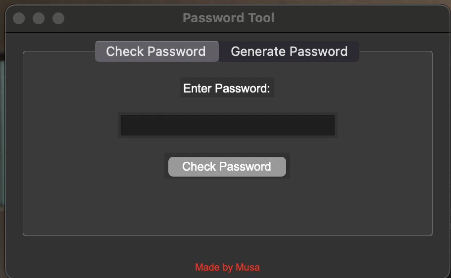
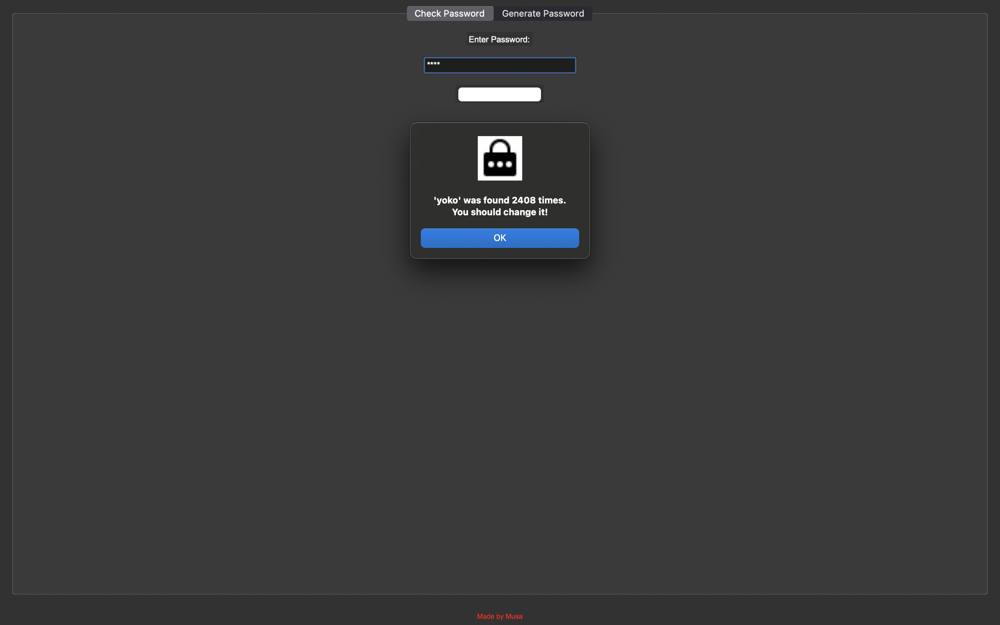
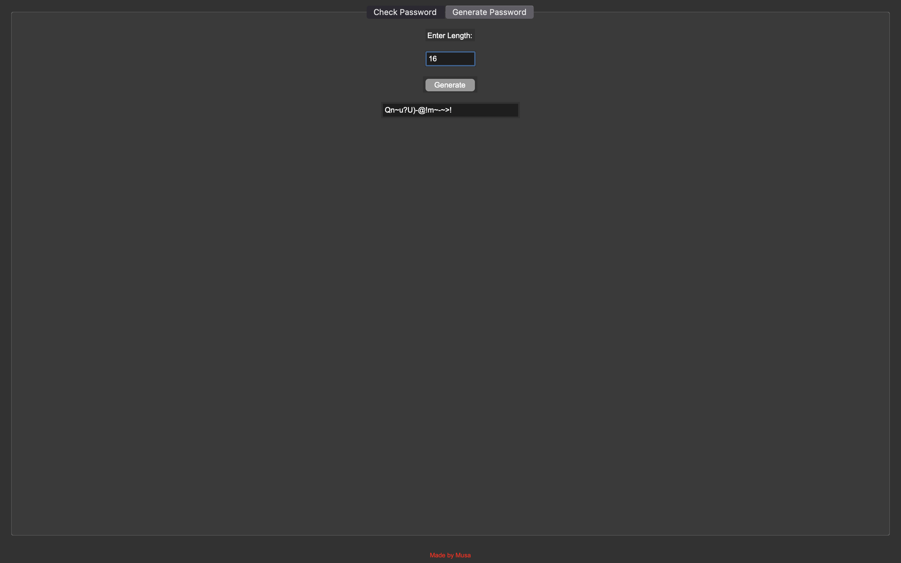

# Tkinter Password Tool 🔐

A simple desktop application built with **Python** and **Tkinter** that allows users to:

- **Check if a password has been compromised** using the [HaveIBeenPwned API](https://haveibeenpwned.com/API/v3).  
- **Generate strong random passwords** of user-defined length.  
- **Automatically warn** if a generated password has been found in data leaks.  
- Provides a **user-friendly GUI** with two tabs for easy interaction.  

---

---

## 📸 Screenshots

### Main Window  
  

### Check Password Tab  
  

### Generate Password Tab  
  


---

##  Features

### 1. Check Password
- Enter a password in the "Check Password" tab.  
- The app will check if it exists in the pwned password database.  
- Shows a **warning** if compromised, or **confirmation** if safe.  

### 2. Generate Password
- Enter desired length (default = 12).  
- Generate a strong random password with letters, numbers, and symbols.  
- Automatically checks if the generated password has been leaked.  
- Provides **real-time feedback** with popup messages.

### 3. GUI
- Built using **Tkinter** for a simple desktop interface.  
- Two tabs: **Check Password** and **Generate Password**.  

---

##  Technologies Used

- **Python 3.x** – Main programming language  
- **Tkinter** – GUI library (built-in)  
- **requests** – For calling the HaveIBeenPwned API to check passwords  
- **hashlib** – To hash passwords before sending to the API (built-in)  
- **random & string** – To generate strong random passwords (built-in)  
- **PhotoImage** – To display an icon for the app (built-in with Tkinter)  

---

##  Requirements

- Python 3.13.1  
- External package: `requests`  

Install dependencies using:

```bash
pip install -r requirements.txt
